# 基于 Lerna 管理 packages 的 Monorepo 项目最佳实践
  [](https://lerna.js.org/) [](https://standardjs.com) [](http://commitizen.github.io/cz-cli/)


## 背景

最近在工作中接触到一个项目，这个项目是维护一套 CLI，发到 npm 上供开发者使用。先看一张图：

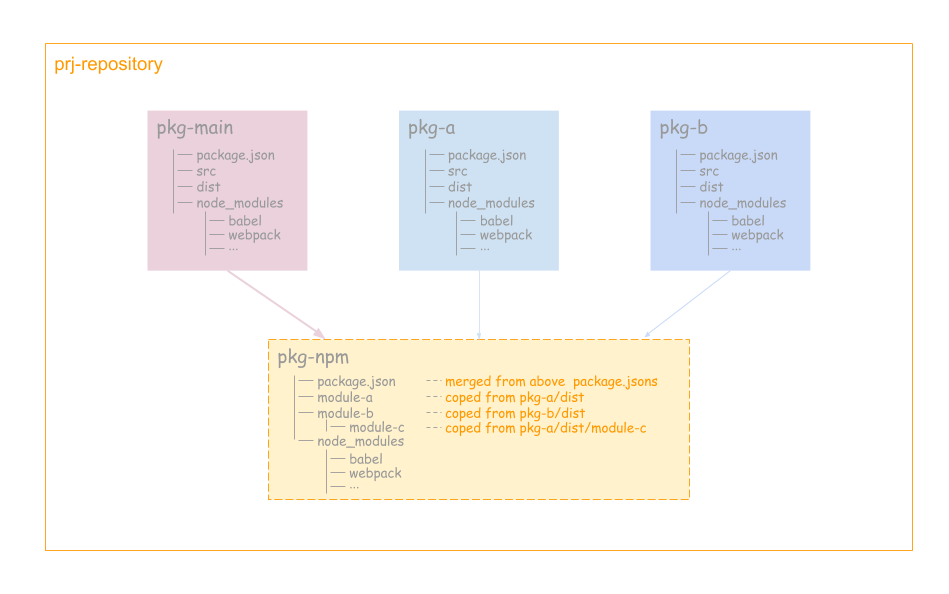

项目仓库中的根目录上就三个子模块的文件夹，分别对应三个 package，在熟悉了构建和发布流程后，有点傻了。工作流程如图中所示：

1. 使用webpack、babel和uglifyjs把 pkg-a 的 src 编译到 dist
2. 使用webpack、babel和uglifyjs把 pkg-b 的 src 编译到 dist
3. 使用webpack、babel和uglifyjs把 pkg-main 的 src 编译到 dist
4. 最后使用拷贝文件的方式，把pkg-main、pkg-a、pkg-b中编译后的文件组装到 pkg-npm 中，最终用于发布到 npm 上去。

**痛点**

1. **不好调试**。因为最终的包是通过文件拷贝的方式组装到一起的，并且都是压缩过的，无法组建一个自上到下的调试流程（实际工作中只能加log，然后重新把包编译组装一遍看效果）

2. **包的依赖关系不清晰**。pkg-a、pkg-b索性没有版本管理，更像是源码级别的，但逻辑又比较独立。pkg-main中的package.json最终会拷贝到 pkg-npm 中，但又依赖pkg-a、pkg-b中的某些包，所以要把pkg-a、pkg-b中的依赖合并到pkg-main中。pkg-main和pkg-npm的package.json耦合在一起，导致一些本来是工程的开发依赖也会发布到 npm 上去，变成pkg-npm 的依赖包。

3. **依赖的包冗余**。可以看到，pkg-a、pkg-b、pkg-main要分别编译，都依赖了babel、webpack等，要分别 `cd` 到各个目录安装依赖。

4. **发布需要手动修改版本号**。 因为最终只发布了一个包，但实际逻辑要求这个包即要全局安装又要本地安装，业务没有拆开，导致要安装两遍。耦合一起，即便使用 `npm link` 也会导致调试困难，

5. **发版没有 `CHANGELOG.md`**。 因为pkg-a、pkg-b都没有真正管理版本，所以也没有完善的CHANGELOG来记录自上个版本发布已来的变动。

整个项目像是一个没有被管理起来的 Monorepo。那什么又是 Monorepo 呢？

## Monorepo vs Multirepo

Monorepo 的全称是 monolithic repository，即单体式仓库，与之对应的是 Multirepo(multiple repository)，这里的“单”和“多”是指每个仓库中所管理的模块数量。

Multirepo 是比较传统的做法，即每一个 package 都单独用一个仓库来进行管理。例如：Rollup, ...

Monorep 是把所有相关的 package 都放在一个仓库里进行管理，**每个 package 独立发布**。 例如：React, Angular, Babel, Jest, Umijs, Vue ...

一图胜千言：

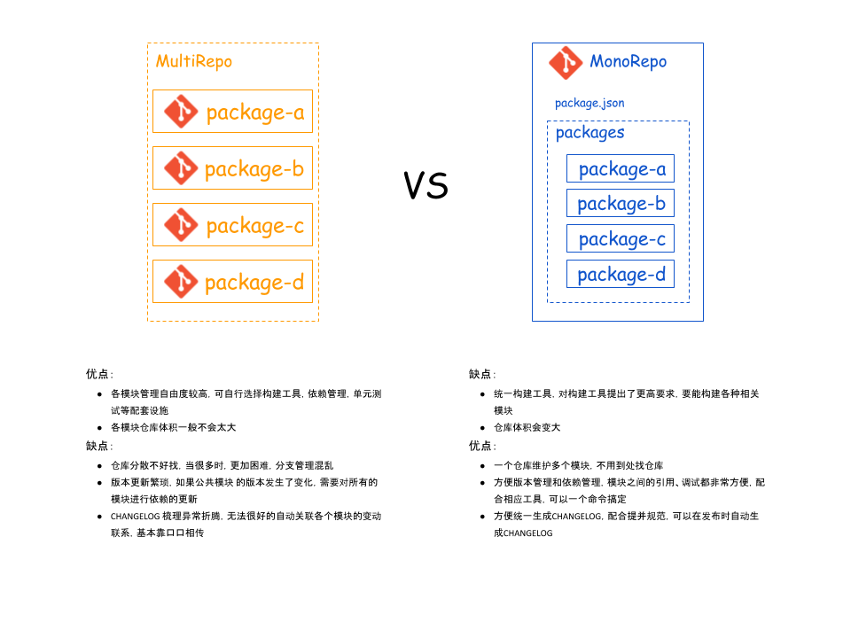

当然到底哪一种管理方式更好，仁者见仁，智者见智。前者允许多元化发展（各项目可以有自己的构建工具、依赖管理策略、单元测试方法），后者希望集中管理，减少项目间的差异带来的沟通成本。

虽然拆分子仓库、拆分子 npm 包是进行项目隔离的天然方案，但当仓库内容出现关联时，没有任何一种调试方式比源码放在一起更高效。

结合我们项目的实际场景和业务需要，天然的 MonoRepo ! 因为工程化的最终目的是让业务开发可以 100% 聚焦在业务逻辑上，那么这不仅仅是脚手架、框架需要从自动化、设计上解决的问题，这涉及到仓库管理的设计。

一个理想的开发环境可以抽象成这样：

“**只关心业务代码，可以直接跨业务复用而不关心复用方式，调试时所有代码都在源码中。**”

在前端开发环境中，多 Git Repo，多 npm 则是这个理想的阻力，它们导致复用要关心版本号，调试需要 `npm link`。而这些是 MonoRepo 最大的优势。

上图中提到的利用相关工具就是今天的主角 Lerna ! Lerna是业界知名度最高的 Monorepo 管理工具，功能完整。

## Lerna

### Lerna 是什么

> A tool for managing JavaScript projects with multiple packages.

> Lerna is a tool that optimizes the workflow around managing multi-package repositories with git and npm.

Lerna 是一个管理多个 npm 模块的工具，是 Babel 自己用来维护自己的 Monorepo 并开源出的一个项目。优化维护多包的工作流，解决多个包互相依赖，且发布需要手动维护多个包的问题。

Lerna 现在已经被很多著名的项目组织使用，如：Babel, React, Vue, Angular, Ember, Meteor, Jest 。

一个基本的 Lerna 管理的仓库结构如下：

```
lerna-repo/
    ┣━ packages/
    ┃     ┣━ package-a/
    ┃     ┃      ┣━ ...
    ┃     ┃      ┗━ package.json
    ┃     ┗━ package-b/
    ┃            ┣━ ...
    ┃            ┗━ package.json
    ┣━ ...
    ┣━ lerna.json
    ┗━ package.json
```

### 开始使用

#### 安装

> 推荐全局安装，因为会经常用到 lerna 命令

```
npm i -g lerna
```

#### 项目构建

1. 初始化

```
lerna init
```
> init 命令详情 请参考 [lerna init](https://github.com/lerna/lerna/blob/master/commands/init/README.md)

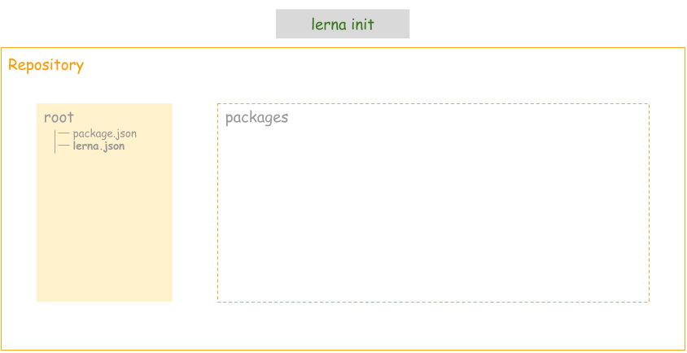

其中 package.json & lerna.json 如下:

```json
// package.json
{
  "name": "root",
  "private": true, // 私有的，不会被发布，是管理整个项目，与要发布到npm的解耦
  "devDependencies": {
    "lerna": "^3.15.0"
  }
}

// lerna.json
{
  "packages": [
    "packages/*"
  ],
  "version": "0.0.0"
}
```


2. 增加两个 packages

```
lerna create @mo-demo/cli
lerna create @mo-demo/cli-shared-utils
```
> create 命令详情 请参考 [lerna create](https://github.com/lerna/lerna/blob/master/commands/create/README.md)

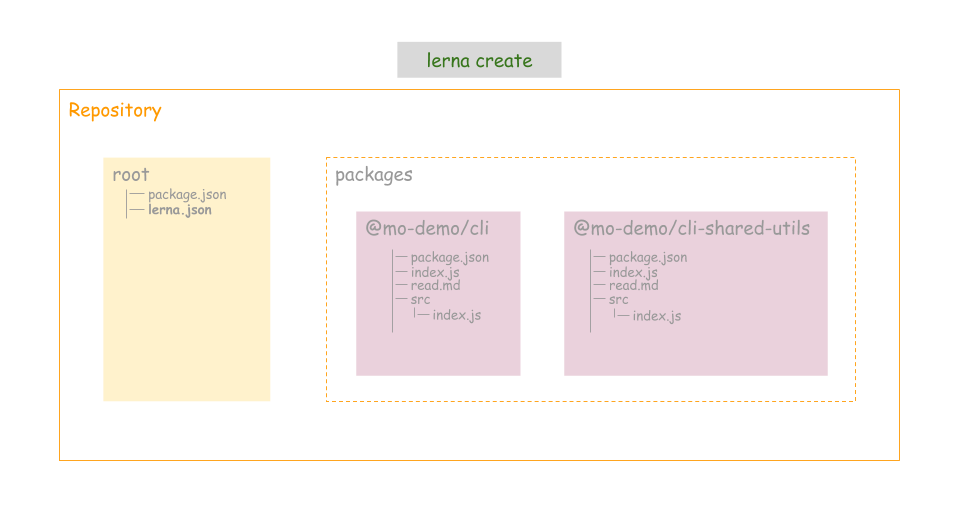

3. 分别给相应的 package 增加依赖模块

```
lerna add chalk                                           // 为所有 package 增加 chalk 模块
lerna add semver --scope @mo-demo/cli-shared-utils        // 为 @mo-demo/cli-shared-utils 增加 semver 模块
lerna add @mo-demo/cli-shared-utils --scope @mo-demo/cli  // 增加内部模块之间的依赖

```

> add 命令详情 请参考 [lerna add](https://github.com/lerna/lerna/blob/master/commands/add/README.md)

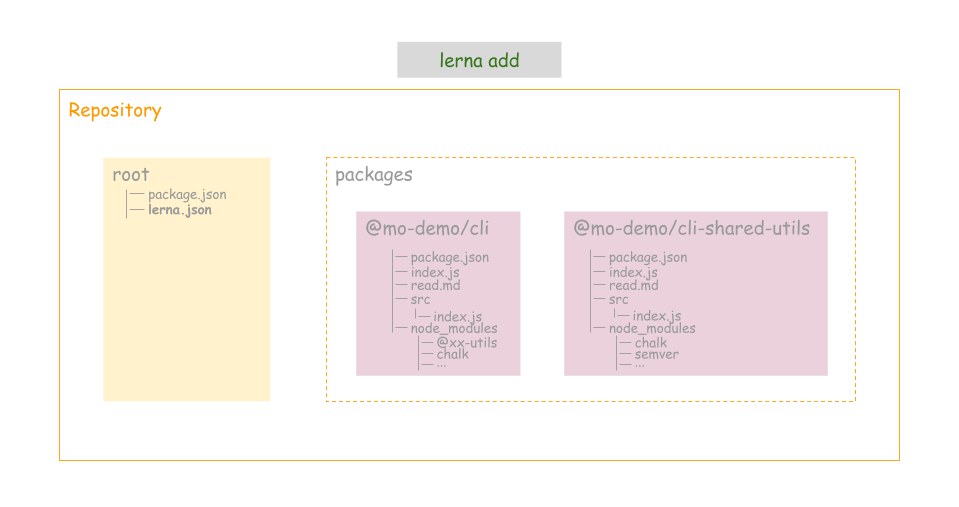

4. 发布

```
lerna publish
```
> publish 命令详情 请参考 [lerna publish](https://github.com/lerna/lerna/blob/master/commands/publish/README.md)

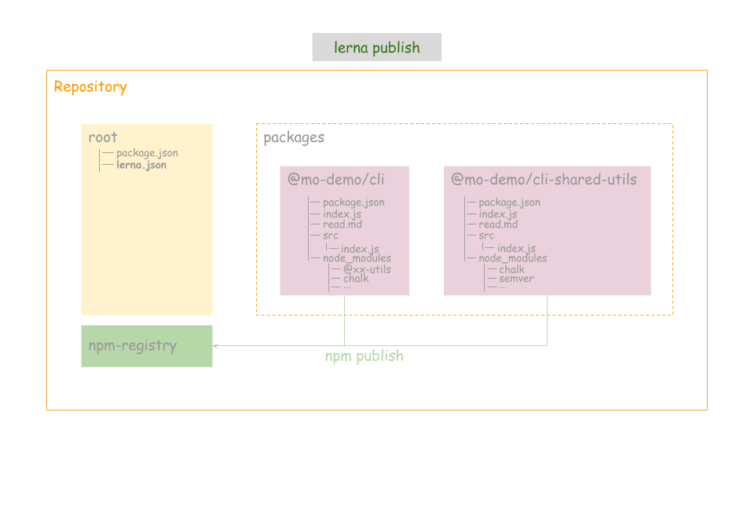

如下是发布的情况，lerna会让你选择要发布的版本号，我发了@0.0.1-alpha.0 的版本。

> **发布 npm 包需要登陆 npm 账号**

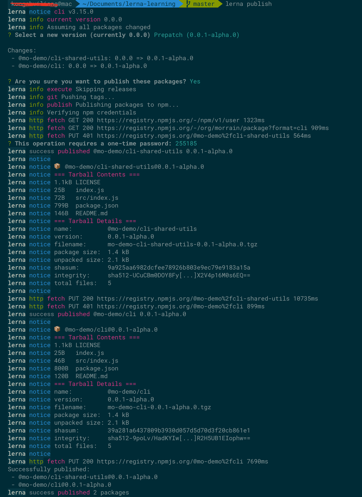


5. 安装依赖包 & 清理依赖包

上述1-4步已经包含了 Lerna 整个生命周期的过程了，但当我们维护这个项目时，新拉下来仓库的代码后，需要为各个 package 安装依赖包。

我们在第4步 `lerna add` 时也发现了，为某个 package 安装的包被放到了这个 package 目录下的 node_modules 目录下。这样对于多个 package 都依赖的包，会被多个 package 安装多次，并且每个 package 下都维护 node_modules ，也不清爽。于是我们使用 --hoist 来把每个 package 下的依赖包都提升到工程根目录，来降低安装以及管理的成本。

```
lerna bootstrap --hoist
```

> bootstrap 命令详情 请参考 [lerna bootstrap](https://github.com/lerna/lerna/blob/master/commands/bootstrap/README.md)

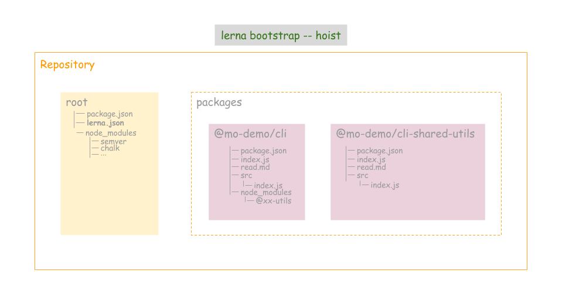

**为了省去每次都输入 --hoist 参数的麻烦，可以在 lerna.json 配置：**

``` json
{
  "packages": [
    "packages/*"
  ],
  "command": {
    "bootstrap": {
      "hoist": true
    }
  },
  "version": "0.0.1-alpha.0"
}
```
配置好后，对于之前依赖包已经被安装到各个 package 下的情况，我们只需要清理一下安装的依赖即可：

```
lerna clean
```
然后执行 `lerna bootstrap` 即可看到 package 的依赖都被安装到根目录下的 node_modules 中了。

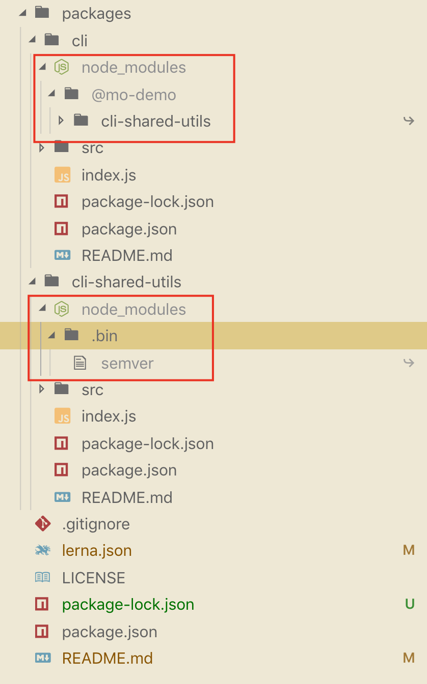

## Lerna的最佳实践

lerna不负责构建，测试等任务，它提出了一种集中管理package的目录模式，提供了一套自动化管理程序，让开发者不必再深耕到具体的组件里维护内容，在项目根目录就可以全局掌控，基于 npm scripts，使用者可以很好地完成组件构建，代码格式化等操作。接下来我们就来看看，如果基于 Lerna，并结合其它工具来搭建 Monorepo 项目的最佳实践。

### 优雅的提交

1. commitizen && cz-lerna-changelog

    [commitizen](http://commitizen.github.io/cz-cli/) 是用来格式化 git commit message 的工具，它提供了一种问询式的方式去获取所需的提交信息。

    [cz-lerna-changelog](https://github.com/atlassian/cz-lerna-changelog) 是专门为 Lerna 项目量身定制的提交规范，在问询的过程，会有类似影响哪些 package 的选择。如下：

    

    我们使用 commitizen 和 cz-lerna-changelog 来规范提交，为后面自动生成日志作好准备。

    因为这是整个工程的开发依赖，所以在根目录安装：
    ```
    npm i -D commitizen
    npm i -D cz-lerna-changelog
    ```

    安装完成后，在 package.json 中增加 config 字段，把 cz-lerna-changelog 配置给 commitizen。同时因为commitizen不是全局安全的，所以需要添加 scripts 脚本来执行 `git-cz`

    ```json
    {
      "name": "root",
      "private": true,
      "scripts": {
        "c": "git-cz"
      },
      "config": {
        "commitizen": {
          "path": "./node_modules/cz-lerna-changelog"
        }
      },
      "devDependencies": {
        "commitizen": "^3.1.1",
        "cz-lerna-changelog": "^2.0.2",
        "lerna": "^3.15.0"
      }
    }
    ```

   之后在常规的开发中就可以使用 `npm run c` 来根据提示一步一步输入，来完成代码的提交。

   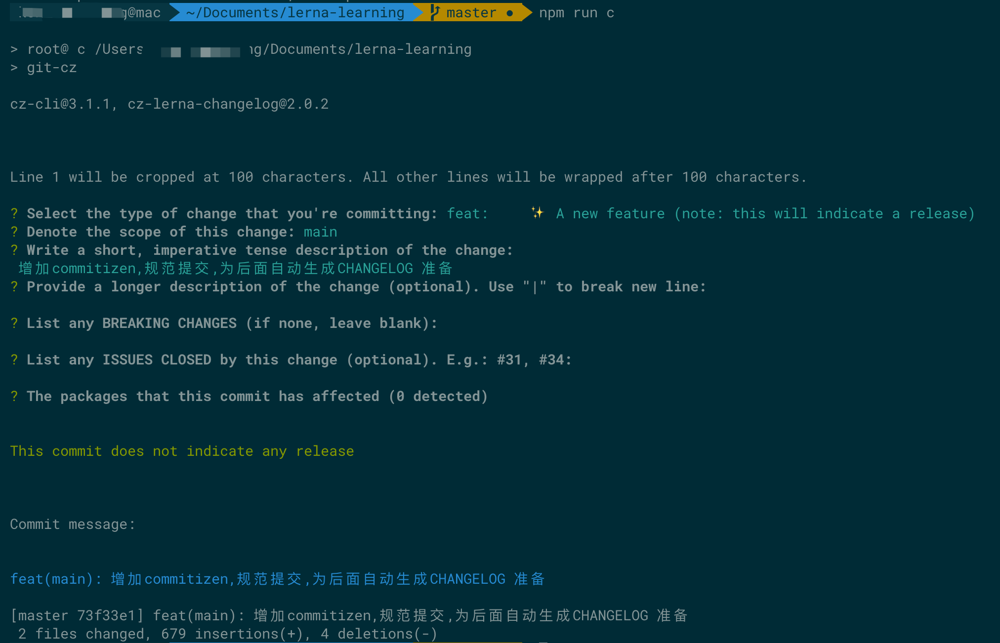

2. commitlint &&  husky

    上面我们使用了 commitizen 来规范提交，但这个要靠开发自觉使用 `npm run c` 。万一忘记了，或者直接使用 `git commit` 提交怎么办？答案就是在提交时对提交信息进行校验，如果不符合要求就不让提交，并提示。校验的工作由 [commitlint](https://commitlint.js.org/#/) 来完成，校验的时机则由 [husky](https://github.com/typicode/husky) 来指定。 husky 继承了 Git 下所有的钩子，在触发钩子的时候，husky 可以阻止不合法的 commit,push 等等

    ```bash
    // 安装 commitlint 以及要遵守的规范
    npm i -D @commitlint/cli @commitlint/config-conventional 
    ```

    ```js
    // 在工程根目录为 commitlint 增加配置文件 commitlint.config.js 为commitlint 指定相应的规范
    module.exports = { extends: ['@commitlint/config-conventional'] }

    ```

    ```
    // 安装 husky
    npm i -D husky
    ```
    ```json
    // 在 package.json 中增加如下配置
    "husky": {
      "hooks": {
        "commit-msg": "commitlint -E HUSKY_GIT_PARAMS"
      }
    }
    ```

    "commit-msg"是git提交时校验提交信息的钩子，当触发时便会使用 commitlit 来校验。安装配置完成后，想通过 `git commit` 或者其它第三方工具提交时，只要提交信息不符合规范就无法提交。**从而约束开发者使用 `npm run c` 来提交。**

3. standardjs && lint-staged

    除了规范提交信息，代码本身肯定也少了靠规范来统一风格。

    [standardjs](https://standardjs.com/readme-zhcn.html)就是完整的一套 JavaScript 代码规范，自带 linter & 代码自动修正。 它无需配置，自动格式化代码并修正，提前发现风格以及程序问题。

    [lint-staged](https://github.com/okonet/lint-staged) staged 是 Git 里的概念，表示暂存区，lint-staged 表示只检查并矫正暂存区中的文件。 一来提高校验效率，二来可以为老的项目带去巨大的方便。


    ``` 
    // 安装
    npm i -D standard lint-staged
    ```

    ```json
    // package.json
    {
      "name": "root",
      "private": true,
      "scripts": {
        "c": "git-cz"
      },
      "config": {
        "commitizen": {
          "path": "./node_modules/cz-lerna-changelog"
        }
      },
      "husky": {
        "hooks": {
          "pre-commit": "lint-staged",
          "commit-msg": "commitlint -E HUSKY_GIT_PARAMS"
        }
      },
      "lint-staged": {
        "*.js": [
          "standard --fix",
          "git add"
        ]
      },
      "devDependencies": {
        "@commitlint/cli": "^8.1.0",
        "@commitlint/config-conventional": "^8.1.0",
        "commitizen": "^3.1.1",
        "cz-lerna-changelog": "^2.0.2",
        "husky": "^3.0.0",
        "lerna": "^3.15.0",
        "lint-staged": "^9.2.0",
        "standard": "^13.0.2"
      }
    }
    ```

    安装完成后，在 package.json 增加 lint-staged 配置，如上所示表示对暂存区中的 js 文件执行 `standard --fix` 校验并自动修复。那什么时候去校验呢，就又用到了上面安装的 husky ，**husky的配置中增加'pre-commit'的钩子用来执行 lint-staged 的校验操作**，如上所示。

    此时提交 js 文件时，便会自动修正并校验错误。即保证了代码风格统一，又能提高代码质量。


### 自动生成日志

有了之前的规范提交，自动生成日志便水到渠成了。再详细看下 `lerna publish` 时做了哪些事情：

  1. 调用 `lerna version` 

      1. 找出从上一个版本发布以来有过变更的 package
      2. 提示开发者确定要发布的版本号
      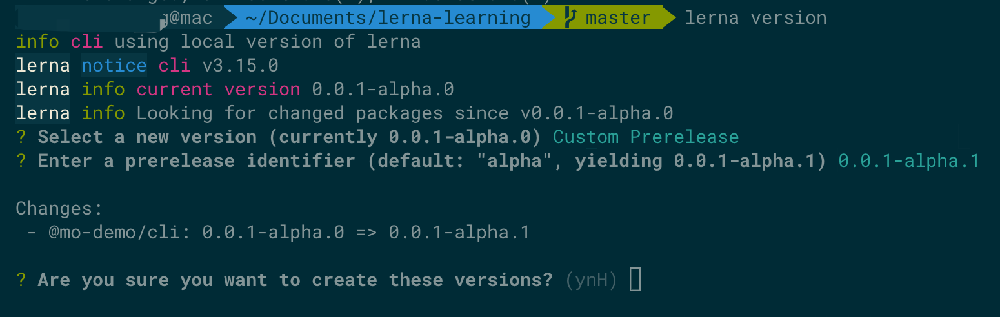
      3. 将所有更新过的的 package 中的package.json的version字段更新
      4. 将依赖更新过的 package 的 包中的依赖版本号更新
      5. 更新 lerna.json 中的 version 字段
      6. 提交上述修改，并打一个 tag 
      7. 推送到 git 仓库

      

  2. 使用 `npm publish` 将新版本推送到 npm

  CHANGELOG 很明显是和 version 一一对应的，所以需要在 `lerna version` 中想办法，查看 [lerna version](https://github.com/lerna/lerna/blob/master/commands/version/README.md) 命令的详细说明后，会看到一个配置参数 `--conventional-commits`。没错，只要我们按规范提交后，在 `lerna version` 的过程中会便会自动生成当前这个版本的 CHANGELOG。 为了方便，不用每次输入参数，可以配置在 lerna.json中，如下：

  ```json
  {
    "packages": [
      "packages/*"
    ],
    "command": {
      "bootstrap": {
        "hoist": true
      },
      "version": {
        "conventionalCommits": true
      }
    },
    "ignoreChanges": [
      "**/*.md"
    ],
    "version": "0.0.1-alpha.1"
  }
  ```

  > `lerna version` 会检测从上一个版本发布以来的变动，但有一些文件的提交，我们不希望触发版本的变动，譬如 .md 文件的修改，并没有实际引起 package 逻辑的变化，不应该触发版本的变更。可以通过 `ignoreChanges` 配置排除。如上。


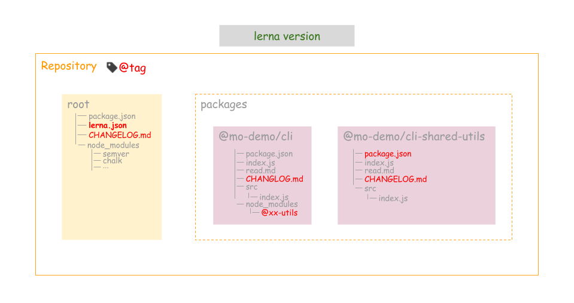

> 实际 `lerna version` 很少直接使用，因为它包含在 `lerna publish` 中了，直接使用 `lerna publish`就好了。

> Lerna 在管理 package 的版本号上，提供了两种模式供选择 Fixed or Independent。默认是 Fixed，更多细节，以及 Lerna 的更多玩法，请参考官网文档： https://github.com/lerna/lerna/blob/master/README.md


### 最佳实践背后的工作流

##  参考文献

[手摸手教你玩转 Lerna](http://www.uedlinker.com/2018/08/17/lerna-trainning/)

[精读《Monorepo 的优势》](https://mp.weixin.qq.com/s/f2ehHTNK9rx8jNBUyhSwAA)

[使用lerna优雅地管理多个package](https://zhuanlan.zhihu.com/p/35237759)

[用 husky 和 lint-staged 构建超溜的代码检查工作流](https://segmentfault.com/a/1190000009546913)

